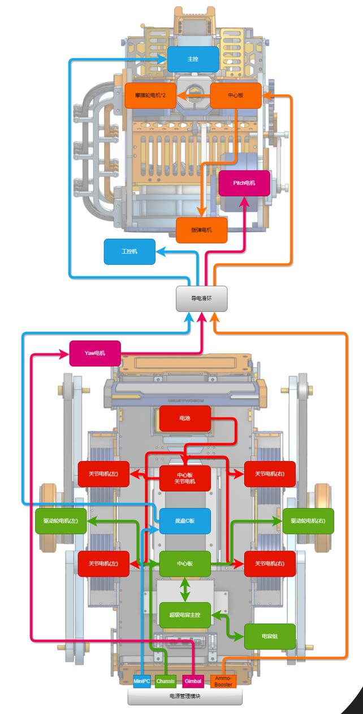

# 通信设计

本研究中，我采用了CAN总线通信技术实现整机的大规模通信。具体而言，整机采用了3个CAN网络，其中导电滑环的上下两个部分通过两个独立的CAN网络进行连接。

同时，上下主控板之间也使用一根CAN总线进行通信。考虑到关节电机设备数量众多且发送频率较高的特点，我将其和驱动轮电机分别拆分到两个独立的CAN网络中，并由下主控板进行控制。

这样的设计不仅使得整车通信结构清晰、可靠，还有效降低了通信冲突和干扰，为机器人的稳定运行提供了可靠的通信保障。

