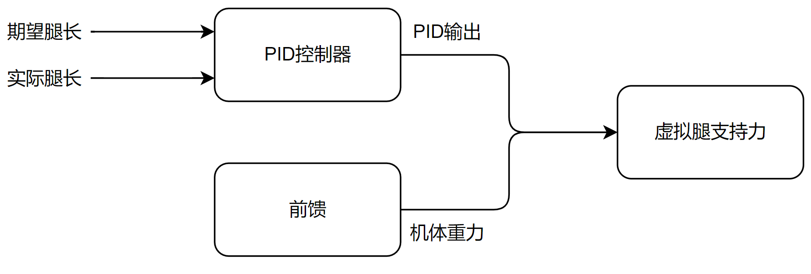
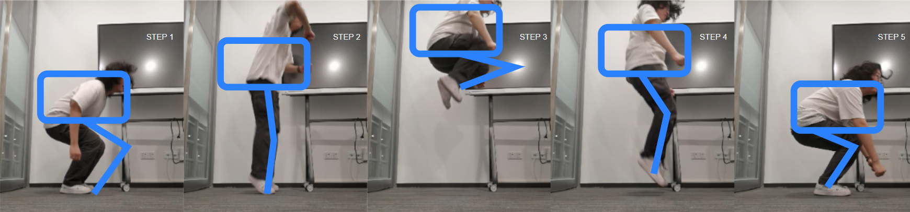
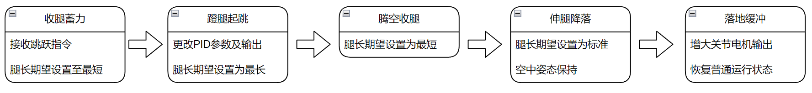
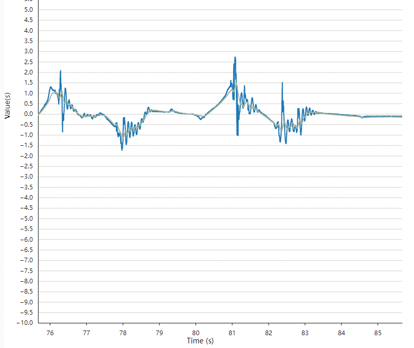
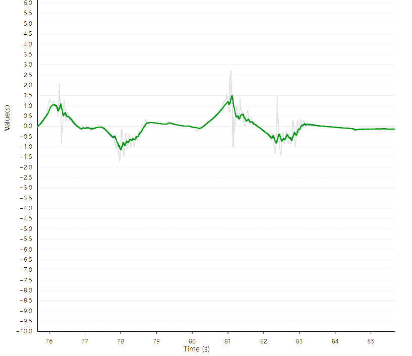

## 直腿机器人系统建模                               

等效虚拟直腿轮腿机器人。

这一部分看完玺老的分享：[RoboMaster平衡步兵机器人控制系统设计 - 知乎 (zhihu.com)](https://zhuanlan.zhihu.com/p/563048952)

本工程与该分享中的建模完全一致，大家先仔细阅读上文章。

## Matlab实现

Matlab主要用来实现LQR中K矩阵求解，本项目和传统LQR控制项目中对K矩阵处理由区别：实际机器人的腿长是会变化的，而在嵌入式平台上每一个控制周期计算一次K矩阵是不切实际的。

在Matlab程序中，将实际能到达的腿长的最小值和最大值间，平均分成多份，每一个长度进行一次K矩阵运算并保存，再使用多项式拟合来得到K矩阵各项与实际腿长的关系，从而把矩阵运算转成多项式运算。

## 五连杆机器人系统建模

目的是得到沿虚拟腿方向的推力$F$和沿重心轴的力矩$T_p$  ,与两关节电机转矩$T_1、T_2$的关系。

我的解算依旧参考：[五连杆运动学解算与VMC - 知乎 (zhihu.com)](https://zhuanlan.zhihu.com/p/613007726)

## 腿长控制

机器人的$z$轴自由度和$Roll$轴自由度需要改变机器人腿长，机器人的腿长控制主要为一个PIDF（Proportional-Integral-Derivative-Feedforward）控制器实现。

机器人两腿各有一个PIDF控制器，分别控制两腿的虚拟长度，两腿长度配合变化可以改变整车高度和  轴角度等。

**控制逻辑**

**输入期望腿长：** 设置期望的腿长作为控制系统的期望值。

**输入实际腿长：** 获取实际腿长的反馈信息。

**误差计算：** 计算期望腿长和实际腿长之间的误差。

**PID控制器：**通过比例（P）、积分（I）、微分（D）三个环节计算控制输出，输出为力。

**前馈控制：** 将重力值作为前馈输入，以提前补偿系统。

**输出支持力：** 将PID控制器的输出和前馈控制的输出相结合，得到最终的支持力输出。

## 转向设计

轮腿机器人本质上可以简化成一个差速底盘，转向时，差速底盘通过改变每个驱动轮的转速差，来实现转向动作。在此控制系统中，驱动轮电机使用转矩控制，所以最终通过控制驱动轮电机的转矩来控制转向。

这个过程使用PID控制器来实现机器人的转向。首先，通过传感器获取机器人当前的期望角度和实际角度。然后，将这两个角度值输入到PID控制器中，该控制器会计算出两个轮子所需的转矩补偿。接着，将这个转矩补偿作为控制信号叠加到每个轮子的驱动系统，使得两个轮子产生不同的转矩，从而实现车辆的转向动作，使车辆能够准确地响应期望角度的变化，并在运动过程中保持稳定。

## 转向双腿同步处理

轮腿机器人的转向环会控制机器人两驱动轮的输出转矩不同，若两个轮子输出的转矩不同，会导致两条腿的运动不同步，出现所谓的“劈叉”现象。具体来说，由于轮子的转矩不均，使得机器人在行走或转向过程中，一条腿运动速度快于另一条腿，造成机器人身体不平衡，呈现出一侧腿向前，另一侧腿向后的情况，即“劈叉”。这种不同步的运动会影响机器人的稳定性和运动效率，甚至可能导致机器人无法顺利移动或转向。因此，解决两轮输出转矩不同的问题对于轮腿机器人的运动控制至关重要。

驱动轮存在转矩差是不可避免的，本项目中通过调整虚拟关节转矩来解决这一问题。本研究的解决方案基于运动学正解方法，通过计算虚拟关节的角度，以及将两腿虚拟关节的角度差作为反馈信号。在此基础上，我们将期望的角度差设置为零，并将其作为输入传入PID控制器中。PID控制器根据当前的角度差与期望值之间的偏差，输出一个虚拟关节的转矩差。该关节转矩差在一定程度上抑制了驱动轮将腿向前后摆动，通过调节这个转矩差，我们实现了两腿的同步运动，从而有效解决了轮腿机器人在转向过程中由于两轮输出转矩不同而导致的不同步问题。这一方法不仅提高了机器人的运动效率和稳定性，也为解决类似问题提供了新的思路和方法。

## 空中姿态保持

在机器人进行跳跃或者跌落的瞬间，往往无法确保机器人是否具有一个初始的旋转速度，这导致了机器人在落地时姿态无法确定的情况。然而，落地时最先接触地面的是机器人的轮子，因此空中腿部的姿态比机体姿态更为重要。这直接影响着机器人在落地瞬间是否能够维持平衡状态，如果姿态不佳甚至可能导致翻滚等严重后果的发生。因此，我们需要在空中保持腿部的姿态垂直于地面，以确保机器人在落地时能够保持稳定的姿态，从而避免发生意外情况。

一旦离地检测成功触发，机器人的所有系统输入将被清零。随后，在LQR控制器计算系统输入时，只会保留与腿部角度相关的变量反馈。同时，轮子将保持无输出状态，直到机器人再次落地。在落地后，系统将维持机体水平，以确保机器人在运动过程中的稳定性和安全性。这种控制策略能够有效地应对机器人离地和落地的变化状态，为机器人的控制和运动提供了可靠的保障。

## 跳跃

机器人的跳跃功能仿照人类跳跃分为五个过程：收腿蓄力、蹬腿起跳、腾空收腿、伸腿降落、落地缓冲：

把腿部替换成五连杆为：

在机器人的跳跃过程中，我们采用了柔顺控制中的阻抗控制方法。其原理是在跳跃的不同阶段，通过改变腿部的长度来控制关节输出力矩。具体而言，通过调节腿部的长度，我们可以改变机器人在不同阶段的姿态和动作，从而实现对关节输出力矩的精确控制。这种阻抗控制方法具有灵活性强、响应速度快的特点，能够有效地应对复杂多变的环境。

**收腿蓄力：**

在收腿蓄力阶段，一旦发出跳跃指令，机器人将迅速将腿部收缩至最短腿长。

**蹬腿起跳：**

机器人腿长缩短至最小时，更改腿长控制环PID参数，设置腿长期望为接近最长。此时机器人机体开始向上加速。

**腾空收腿：**

在腾空收腿阶段，机器人在腾空时通过收腿动作能够显著提高轮子离地高度，从而增加机器人跨越障碍物的能力。一旦检测到机器人的腿长已经伸展至最长，立即将腿长期望值设置为最短，以实现快速收腿。

**伸腿降落：**

伸腿降落阶段，机器人在即将落地之前会提前伸出腿部，以确保落地时具备足够的缓冲距离，起到类似于电动悬挂的作用。当机器人的腿长缩短至最短时，将腿长期望值设定为标准腿长，并启用空中姿态控制。

**落地缓冲：**

最后，在落地缓冲阶段，当机器人接触地面瞬间，双腿支持力急剧增加，表明机器人已经着地。此时会增大腿部转矩输出，以实现缓冲效果。当机器人向下加速度接近零时，即可判定机器人已经恢复平稳状态，缓冲阶段结束，机器人回到普通运行阶段，跳跃过程顺利完成。

## 不理想路面处理

在实际应用中，机器人行驶的路面并非总是平坦且具有足够的摩擦力。例如，在盲道或者石子路面上行驶时，轮子会先受到阻力减速，然后由于惯性而越过障碍物，导致速度出现两次剧烈抖动（一次是遇到障碍，一次是落地），甚至在抖动过程中速度会出现反向的情况。而在湿滑坡道上行驶时，轮子可能会旋转但车辆不能被有效驱动，此时轮子存在一定的速度，但整车却没有移动。在这种情况下，将轮子速度视作整车速度是不准确的，因为当车辆经过颠簸路面或发生打滑时，速度并未发生剧烈变化，此时使用的模型将会出现偏差。

本项目中针对这一问题对机器人的速度获取方式做了一定优化。将机器人的轮子速度和机体中加速度计的加速度进行融合。使用卡尔曼滤波器估测出更符合实际的速度反馈。

1、预测步骤：

**状态预测：**利用系统动力学模型，通过上一时刻的状态估计值和控制输入，预测当前时刻的状态。
$$
x ̂_{(k|k-1)}=F_k x ̂_{(k-1)}+B_k u_k
$$
其中，$x ̂_{(k|k-1)}$是预测的状态估计值，$F_k$是状态转移矩阵，$x ̂_{(k-1)}$是上一时刻的状态估计协方差矩阵，$B_k$是输入控制矩阵，$u_k$是控制输入。

**协方差预测：**利用系统动力学模型和过程噪声协方差，预测当前时刻状态估计值的不确定性。

 
$$
P_{(k|k-1)}=F_k P_{(k-1)} F_k^T+Q_k
$$
其中，$P_{(k|k-1)}$是预测的状态估计协方差矩阵，$P_{(k-1)}$是上一时刻的状态估计协方差矩阵，$Q_k$是过程噪声协方差矩阵。

2、更新步骤：

**计算卡尔曼增益：**利用测量模型和测量噪声协方差，计算卡尔曼增益。 
$$
K_k=P_{(k|k-1)} H_k^T (H_k P_{(k|k-1)} H_k^T+R_k )^{(-1)}
$$
其中，$K_k$是卡尔曼增益，$H_k$是测量模型，$R_k$是测量噪声协方差矩阵。

**更新状态估计：**利用预测值和测量值，通过卡尔曼增益修正状态估计值。 
$$
x ̂_k=x ̂_{(k|k-1)}+K_k (z_k-H_k x ̂_{(k|k-1)} )
$$
其中，$x ̂_k$是更新后的状态估计值，$z_k$是当前时刻的测量值。

**更新协方差：**利用卡尔曼增益，通过测量更新状态估计协方差。
$$
P_k=(I-K_k H_k ) P_{(k|k-1)}
$$
 其中，  是更新后的状态估计协方差矩阵。

通过以上预测和更新步骤，利用卡尔曼滤波器可以融合轮子速度和加速度计加速度，得到更准确的整机器人速度估计。

最终结果如图，可以观察到原有的大幅抖动被很好的处理，机器人在越过障碍或打滑时机体速度反馈也较为稳定，在非理想路面上也能运行平稳。

